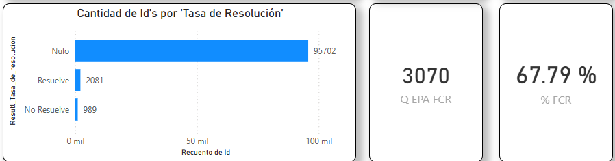

## %FCR / Tasa de Resolución

### Objetivo

% de Respuestas de clientes que declara que su problema fue resuelto

### Fórmula

``` dax
#% FCR = 
DIVIDE(
    CALCULATE(
        COUNT(onemarketer_encuesta_data_cruda[Id]) , FILTER(
            onemarketer_encuesta_data_cruda, LOWER(onemarketer_encuesta_data_cruda[Resutl_Tasa_de_resolucion])="resuelve"
        )
    ),
    CALCULATE(
        COUNT(onemarketer_encuesta_data_cruda[Id]) , FILTER(
            onemarketer_encuesta_data_cruda, onemarketer_encuesta_data_cruda[Resutl_Tasa_de_resolucion]<>"Nulo"
        )
    ),
0)
```
### Interpretación

- > 0 : predominan clientes satisfechos.
- = 0 : equilibrio.
- < 0 : predominan clientes insatisfechos.


### Dependencias

Tabla:
- onemarketer_encuesta_data_cruda

Columnas:
- Id
- Resutl_Eval_IA

### KPI Dashboard



