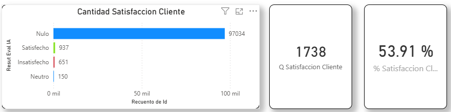

## %Satisfaccion cliente / CSAT

### Objetivo

Mide que Tan satisfecho esta el usuario con el Canal

### Fórmula

``` dax
#% Satisfaccion Cliente (CSAT) = 
DIVIDE(
    CALCULATE(COUNT(onemarketer_encuesta_data_cruda[Id]) , FILTER(
        onemarketer_encuesta_data_cruda, lower(onemarketer_encuesta_data_cruda[Resutl_Eval_IA])="satisfecho"
    ))
    ,CALCULATE(
        COUNT(onemarketer_encuesta_data_cruda[Id]) , FILTER(
            onemarketer_encuesta_data_cruda, onemarketer_encuesta_data_cruda[Resutl_Eval_IA]<>"Nulo")
        )
    ,0)
```
### Interpretación

- > 0 : predominan clientes satisfechos.
- = 0 : equilibrio.
- < 0 : predominan clientes insatisfechos.


### Dependencias

Tabla:
- onemarketer_encuesta_data_cruda

Columnas:
- Id
- Resutl_Eval_IA

### KPI Dashboard



