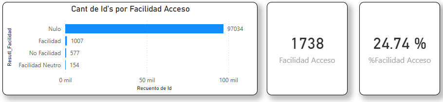

## %Facilidad Acceso

### Objetivo

Evalua que tan facil es acceder a emilia

### Fórmula

``` dax
#%Facilidad_Acceso = 
DIVIDE(
    CALCULATE(
        COUNT(onemarketer_encuesta_data_cruda[Id]) , FILTER(
            onemarketer_encuesta_data_cruda, LOWER(onemarketer_encuesta_data_cruda[Resutl_Facilidad]) ="facilidad"))
    ---- todo lo que no sea Nulo
    ,CALCULATE(
        COUNT(onemarketer_encuesta_data_cruda[Id]) , FILTER(
            onemarketer_encuesta_data_cruda, onemarketer_encuesta_data_cruda[Resutl_Facilidad]<>"Nulo"
        ))
    ,0)
```
### Interpretación

- > 0 : predominan clientes satisfechos.
- = 0 : equilibrio.
- < 0 : predominan clientes insatisfechos.


### Dependencias

Tabla:
- onemarketer_encuesta_data_cruda

Columnas:
- Id
- Resutl_Eval_IA

### KPI Dashboard



