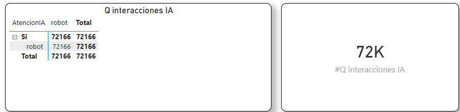

## Q interacciones IA

### Objetivo

Mide las interacciones abiertas y cerradas por Emilia

### Fórmula

``` dax
Q interacciones IA

#Q interacciones IA =
CALCULATE(
    COUNT(onemarketer_encuesta_data_cruda[Id]),
    FILTER(
        onemarketer_encuesta_data_cruda,
        LOWER(onemarketer_encuesta_data_cruda[OperadorAbre]) = "robot"
    ),
    FILTER(
        onemarketer_encuesta_data_cruda,
        LOWER(onemarketer_encuesta_data_cruda[OperadorCierra]) = "robot"
    ),
    FILTER(
        onemarketer_encuesta_data_cruda,
        LOWER(onemarketer_encuesta_data_cruda[AtencionIA]) = "si"
    )
)
```
### Interpretación

Cantidad de interacciones realizas exclusivamente por Emilia

### Dependencias

Tabla:
- onemarketer_encuesta_data_cruda

Columnas:
- Id
- Resutl_Eval_IA

### KPI Dashboard



