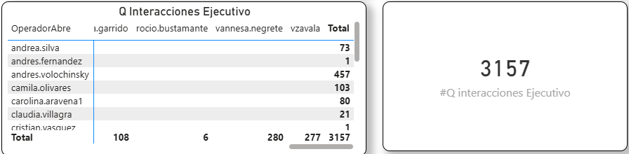

## Q interacciones Ejecutivo

### Objetivo

Mide las interacciones abiertas y cerradas por Ejecutivos

### Fórmula

``` dax
Q interacciones Ejecutivo

#Q interacciones Ejecutivo = 
CALCULATE(
    COUNT(onemarketer_encuesta_data_cruda[Id]),
    FILTER(
        onemarketer_encuesta_data_cruda,
        NOT (
            LOWER(onemarketer_encuesta_data_cruda[OperadorAbre])
                IN {"robot", "admin"}
        )
        &&
        NOT (
            LOWER(onemarketer_encuesta_data_cruda[OperadorCierra])
                IN {"robot", "admin"}
        )
        &&
        LOWER(onemarketer_encuesta_data_cruda[AtencionIA]) <> "si"
    )
)
```
### Interpretación

Mide las interraciones abiertas y cerradas por ejecutivos


### Dependencias

Tabla:
- onemarketer_encuesta_data_cruda

Columnas:
- Id
- Resutl_Eval_IA

### KPI Dashboard



