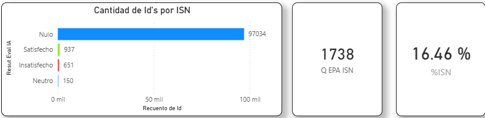

## %Q EPA ISN / Indice de satisfaccion Neta

### Objetivo

Mide la Satisfaccion reltativa del clientes en una escala de 1 a 7:

<br>• Cliente Satisfecha entre 6 y 7 
<br>• Cliente Neutro evalua 5 
<br>• Cliente insatisfecho evalua entra 1 y 4

### Fórmula

``` dax
%Q EPA ISN / CSAT

#%Q EPA ISN = 
DIVIDE(
    CALCULATE(COUNT(onemarketer_encuesta_data_cruda[Id]) , FILTER(
        onemarketer_encuesta_data_cruda, lower(onemarketer_encuesta_data_cruda[Resutl_Eval_IA])="satisfecho"
    ))  
    ,CALCULATE(
        COUNT(onemarketer_encuesta_data_cruda[Id]) , FILTER(
            onemarketer_encuesta_data_cruda, onemarketer_encuesta_data_cruda[Resutl_Eval_IA]<>"Nulo")
        )
    ,0)
```
### Interpretación

- > 0 : predominan clientes satisfechos.
- = 0 : equilibrio.
- < 0 : predominan clientes insatisfechos.


### Dependencias

Tabla:
- onemarketer_encuesta_data_cruda

Columnas:
- Id
- Resutl_Eval_IA

### KPI Dashboard


