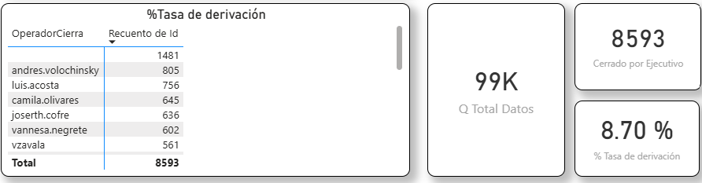

## %Tasa de derivación

### Objetivo

% de conversaciones derivadas y cerradas por un ejecutivo

### Fórmula

``` dax
Cant de datos de la Encuesta

#Cant_Encuesta = CALCULATE(COUNT(onemarketer_encuesta_data_cruda[Id])) 
```

``` dax
#Cerrado por Ejecutivo = 
CALCULATE(
    COUNT(onemarketer_encuesta_data_cruda[Id]),
    FILTER(
        onemarketer_encuesta_data_cruda,
        NOT (
            LOWER(onemarketer_encuesta_data_cruda[OperadorCierra])
                IN {"robot", "admin"}
        )
    )
) 
```

``` dax
#% Tasa de derivación = 
DIVIDE(
    CALCULATE(
        COUNT(onemarketer_encuesta_data_cruda[Id]),
        FILTER(
            onemarketer_encuesta_data_cruda,
            NOT (
                LOWER(onemarketer_encuesta_data_cruda[OperadorCierra])
                    IN {"robot", "admin"}
                )
            )
        )
    ,onemarketer_encuesta_data_cruda[#Cant_Encuesta]
    ,0)
 
```

### Interpretación

Cant_Encuesta / Cerrado por Ejecutivo = % Tasa de derivación

### Dependencias

Tabla:
- onemarketer_encuesta_data_cruda

Columnas:
- Id
- Resutl_Eval_IA

### KPI Dashboard



